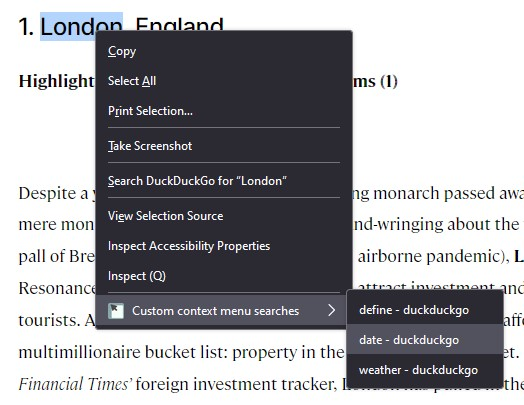
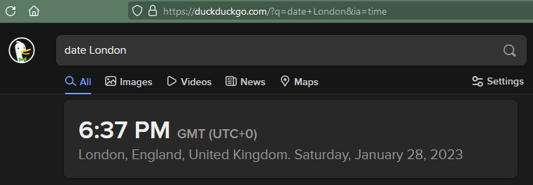
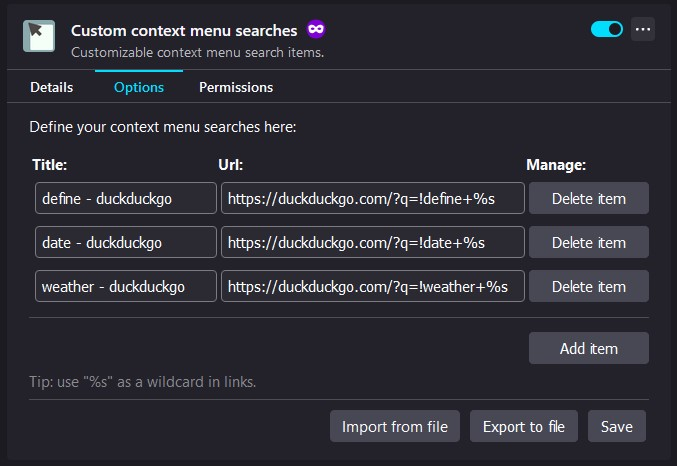

#  Custom context menu searches

Browser extension for Firefox that allows to define custom search items for context menu. In another words, the user is able to assign custom URLs to context menu items. Then it is possible to pass selected text to that URL using context menu. In practice this allows to create custom search engines, dictionaries, maps, etc. in form of context menu items.  

## Overview & Instruction

### Context menu
Defined context menu items will appear in context menu, menu that is opened by right mouse button. Note that these items will only appear in context of selected text. This means that only when there is selected text, the items will show up in context menu. Then by pressing on one of these items, a new tab will appear. The tab will contain previously defined URL of that item together with selected text. 

*Custom context menu items*

*Results of custom context menu item. A new tab with specified URL containing selection text was opened*

### Options page
Extension implements options page where the user can create, modify and delete defined context menu items. This page is located in extensions details in "Manage Your Extensions" page in Browser. Note that any changes made on option page needs to be saved. This is done by clicking on "Save" button.

*Extension's option page where custom context menu items are defined*

#### Create items:
In order to create a context menu item, one has to press on "Add new item" button. This will create new row where a title (this is what will show up in context menu) and a URL (this is what this context menu item will open in new tab) has to be entered. Note that wildcard `%s` is supported in links. This allows to define where selection text should be put in link. To use it, just place `%s` in URL. I.e in case of this URL; `www.example.com/?q=%s&scope=all` the selection text will be put between "=" and "&" like so: `www.example.com/?q=foo&scope=all`. If no `%s` is placed in URL, the selection text will be appended at the end of the URL.

**Note** that extension does implement soft input validation. In practice this means that titles are restricted to 30 chars, URL to 200 chars and cannot contain spaces and selection text will be limited to 200 chars. Soft input validation also means that it can lead to unexpected situations as unwanted chars will not be blocked. Therefore enter values with caution.

#### Modify items:
One can modify defined context menu items by directly modifying previously entered values.

#### Delete items:
In order to delete context menu item, one has to press on "Delete item" button next to item that should be deleted. 

## Installation
Available for Firefox via: https://addons.mozilla.org/en-US/firefox/addon/custom-context-menu-searches/

In addition you also install it as local debug install. **Note that you will have to install it every time you open the browser**
- [Installing extension locally](https://developer.mozilla.org/en-US/docs/Mozilla/Add-ons/WebExtensions/Your_first_WebExtension#installing)

## Bugs & to do
See issues on this repo

