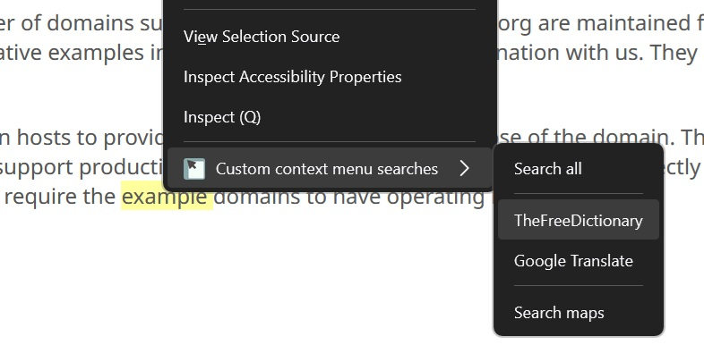
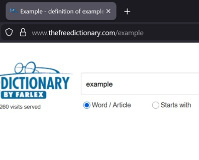
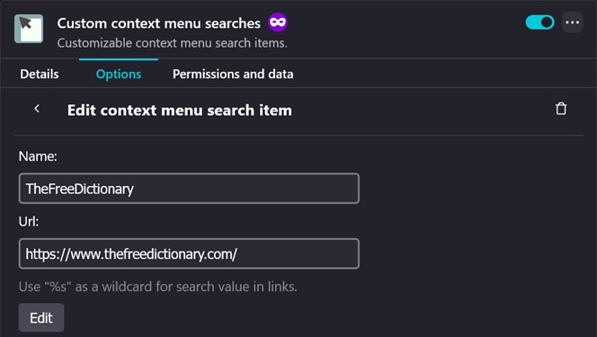

#  Custom context menu searches

Browser extension for Firefox that allows to search using custom URLs directly from context menu. In practice this allows to create personalized search engines, dictionaries, maps, etc. that can be easily accessed from context menu.

## Overview & Instruction

### Context menu
Custom defined URLs will appear in the context menu, menu that is opened by right mouse button. Note that these items will only appear when a text is selected.

*Custom context menu items*

*Results of custom context menu item. A new tab with specified URL containing selection text was opened*

### Options page
The extension implements a GUI where the user can create, modify and delete the data. This page is located in extensions details in "Manage Your Extensions" page in Browser.

*Extension's option page where custom context menu items are defined*

#### Defining custom URLs
Custom URL is defined by creating an new item using the options page. Wildcard `%s` is supported in URLs which allows to control where selected text will appear. To use it, just place `%s` in URL. I.e in case of this URL; `www.example.com/?q=%s&scope=all` the selection text (in this case `foo`) will be put between "=" and "&" like so: `www.example.com/?q=foo&scope=all`. If no `%s` is placed in URL, the selection text will be appended at the end of the URL.

**Note** that extension does implement soft input validation. In practice this means that titles are restricted to 30 chars, URL to 200 chars and cannot contain spaces and selection text will be limited to 200 chars. Soft input validation also means that it can lead to unexpected situations as unwanted chars will not be blocked. Therefore enter values with caution.

#### Groups
Groups allows to combine more that one URL in one. Accessing group from the context menu will result in opening all URLs defined in that group. New groups are created empty so they need to be managed afterwards.

#### Actions
Actions are special kind of items that perform an action instead of opening a custom URL. Currently supported actions are following:

- Open options page - opens options page where data can be managed.
- Open all (excluding groups) - opens all defined URLs omitting groups
- Open all (including groups) - opens all defined URLs also from groups (use with caution if many URLs are defined)

Actions items are normally accessed from the context menu.

#### Separators
Separators can be used to graphically divide previously defined items on the context menu.

#### Export data:
It is also possible to export defined context menu items to a .json file.

#### Import data:
Context menu items can also be directly imported from a .json file. Doing so will override all previously defined items with what is defined in the file. This functionality is primary designed to be used with the .json file created by the export data functionality, but it can also be created manually. The .json file use following format:

Firstly, an main array is defined which holds all the other objects.
`{"context_menu_items": [--objects goes here--]}` 

Then, other items can be defined using following objects notations:

- Object notation for default item:
`{"title": "Example", "url": "www.example.com/?search="}`

- Object notation for group:
`{"title": "Group", "urls": ["www.example.com/?search=", "www.example.com/?search"]}`

- Object notation for action item:
`{"title": "Action", "action": "1"}` where
1 = Open options page, 2 = Open all (excluding groups), 3 = Open all (including groups)

- Object notation for separator:
`{"separator": "separator"}`

Note that the .json file size are restricted to 10 000 bytes meaning it is possible to import about 100 context menu items (depending on the length of the titles and urls).

#### Suggestions:
The extension include predefined searches that user can make use of. Suggestions are automatically added to the list where they can be modified. As there is more predefined items than it is shown, searching for given item may become helpful. Currently there is around 15 predefined searches which mostly consist of search engines, more may come in the future. 

## Installation
Available for Firefox via: https://addons.mozilla.org/en-US/firefox/addon/custom-context-menu-searches/

In addition you also install it as local debug install. **Note that you will have to install it every time you open the browser**
- [Installing extension locally](https://developer.mozilla.org/en-US/docs/Mozilla/Add-ons/WebExtensions/Your_first_WebExtension#installing)

## Bugs & to do
See issues on this repo

