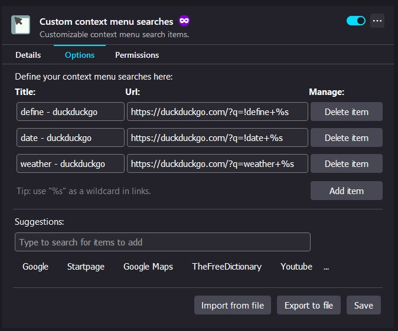

#  Custom context menu searches

Browser extension for Firefox that allows to define custom search items for context menu. In other words, the user is able to search by custom URLs directly from context menu. In practice this allows to create custom search engines, dictionaries, maps, etc. in form of context menu items. 

## Overview & Instruction

### Context menu
Custom defined URLs will appear in the context menu, menu that is opened by right mouse button. Note that these items will only appear when a text is selected.

*Custom context menu items*

*Results of custom context menu item. A new tab with specified URL containing selection text was opened*

### Options page
The extension implements a options page where the user can create, modify and delete defined URLs. This page is located in extensions details in "Manage Your Extensions" page in Browser. Note that any changes made on option page needs to be saved. This is done by clicking on "Save" button.

*Extension's option page where custom context menu items are defined*

#### Create items:
In order to create a context menu item, one has to press on "Add new item" button. This will create new row where a title (this is what will show up in context menu) and a URL (this is what this context menu item will open in new tab) has to be entered. Note that wildcard `%s` is supported in links. This allows to define where selection text should be put in link. To use it, just place `%s` in URL. I.e in case of this URL; `www.example.com/?q=%s&scope=all` the selection text will be put between "=" and "&" like so: `www.example.com/?q=foo&scope=all`. If no `%s` is placed in URL, the selection text will be appended at the end of the URL.

**Note** that extension does implement soft input validation. In practice this means that titles are restricted to 30 chars, URL to 200 chars and cannot contain spaces and selection text will be limited to 200 chars. Soft input validation also means that it can lead to unexpected situations as unwanted chars will not be blocked. Therefore enter values with caution.

#### Modify items:
One can modify defined context menu items by directly modifying previously entered values.

#### Delete items:
In order to delete context menu item, one has to press on "Delete item" button next to item that should be deleted.

#### Export items:
It is also possible to export defined context menu items to a .json file. Note that the export functionality exports directly from the storage meaning that any unsaved change will not be reflected in the exported file. Items are exported to a file by utilizing the "Export to file" button on the extensions options page.

#### Import items:
Context menu items can also be directly imported from a .json file. Doing so will override all previously defined items with what is defined in the file. The context menu items are defined in the .json file by following format:

`{"context_menu_items": [{"title": "Example 1","url": "www.example.com/?search="},{"title": "Example 2","url": "www.example.com/?search="}]}`  

Note that the .json file size are restricted to 10 000 bytes meaning it is possible to import about 100 context menu items (depending on the length of the titles and urls). Items are imported by utilizing the "Import from file" button on the extensions options page and selecting a file.

#### Suggestions:
The extension include predefined searches that user can make use of. In order to do that, the user has to press on one of titles shown below the search box. Clicked item will be automatically added to the list. As there is more predefined items than it is shown, searching for given item may become helpful. Currently there is around 15 predefined searches which mostly consist of search engines, more may come in the future. 

## Installation
Available for Firefox via: https://addons.mozilla.org/en-US/firefox/addon/custom-context-menu-searches/

In addition you also install it as local debug install. **Note that you will have to install it every time you open the browser**
- [Installing extension locally](https://developer.mozilla.org/en-US/docs/Mozilla/Add-ons/WebExtensions/Your_first_WebExtension#installing)

## Bugs & to do
See issues on this repo

